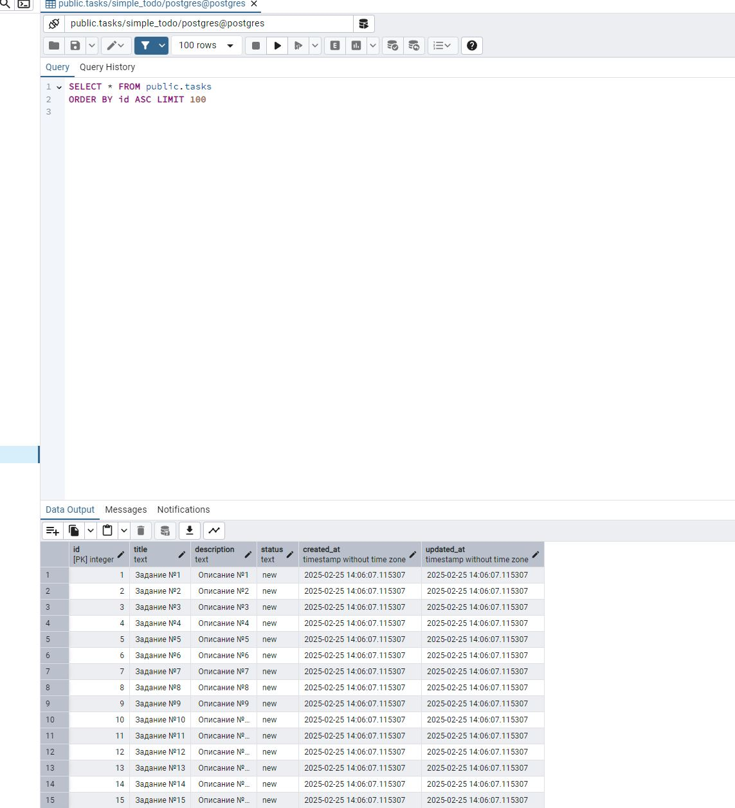
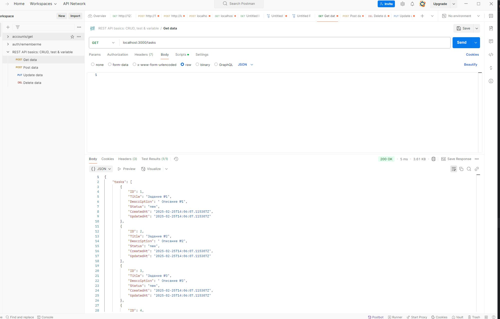
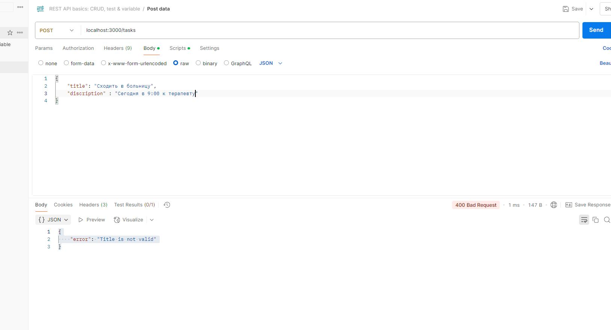
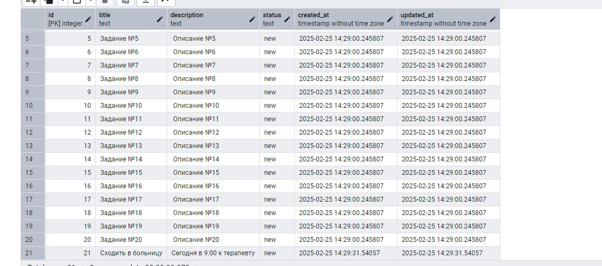
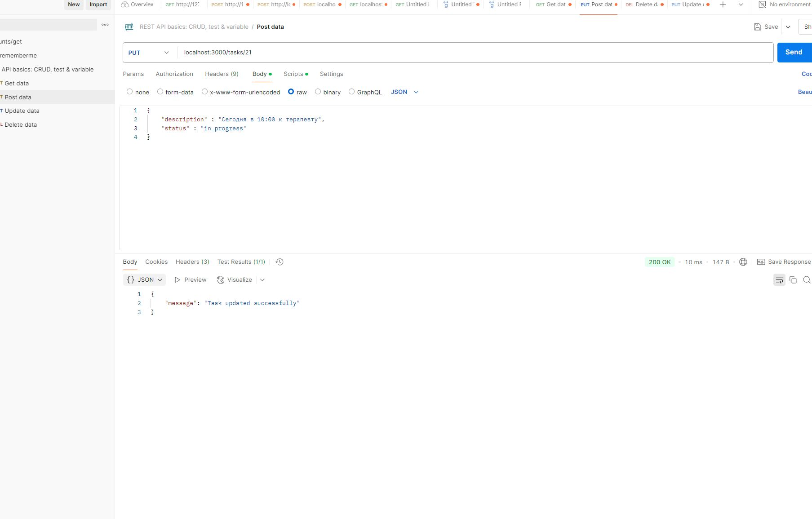
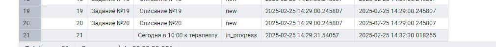
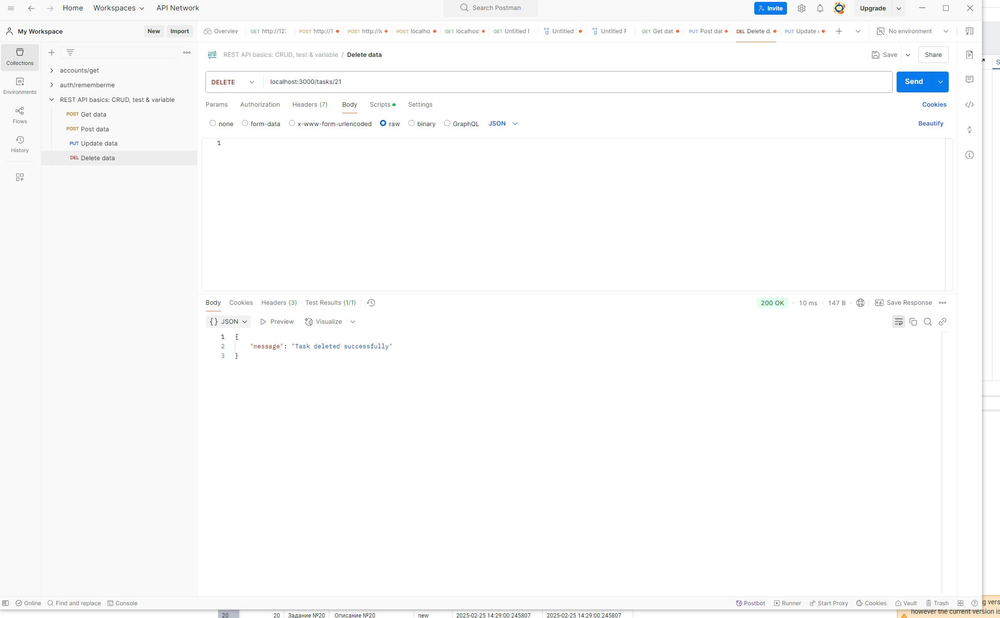
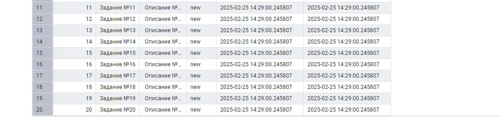

## 📌 Описание проекта

Этот проект представляет собой REST API для управления задачами (TODO-лист), реализованный на **Golang** с использованием **Fiber** и **PostgreSQL**.

Swagger не получилось включить, как оказалось swaggo не обновили к версии Fiber v3, (Я даже не знал, что я делал на новой версии, как я понял, который еще в бете 😢😢😢😢, хотя в документации quickstart был указан именно он https://github.com/gofiber/fiber)

Время выполнения 3 часа

## 🚀 Требования к запуску

Перед запуском убедитесь, что у вас установлены следующие зависимости:

- **Golang** версии 1.24+  
- **Make** (опционально, для удобного управления миграциями и сборкой)
- **Docker-compose** для поднятья бд    
- **Goose** для миграции (make install-goose)  

## ⚙️ Запуск
- **make run-db** Запуск контейнера postgresql 
- **make migration-up** Запуск миграций в бд  
- **make run-server** Запуск Сервера

## 📸 Скриншоты

### 📝 База после миграции

### 🧡📫 Get_запрос

### 🧡📫 Post_запрос

### 📝 База после добавления

### 🧡📫 Put_запрос

### 📝 База после изменения записи

### 🧡📫 Delete_запрос

### 📝 База после удаления записи

